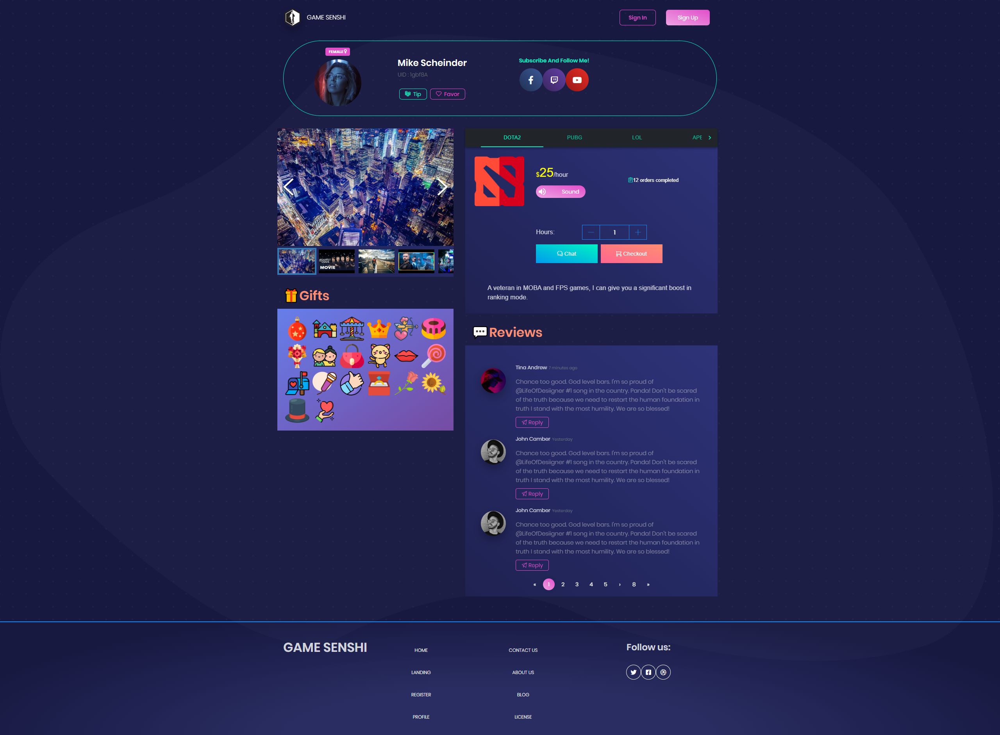
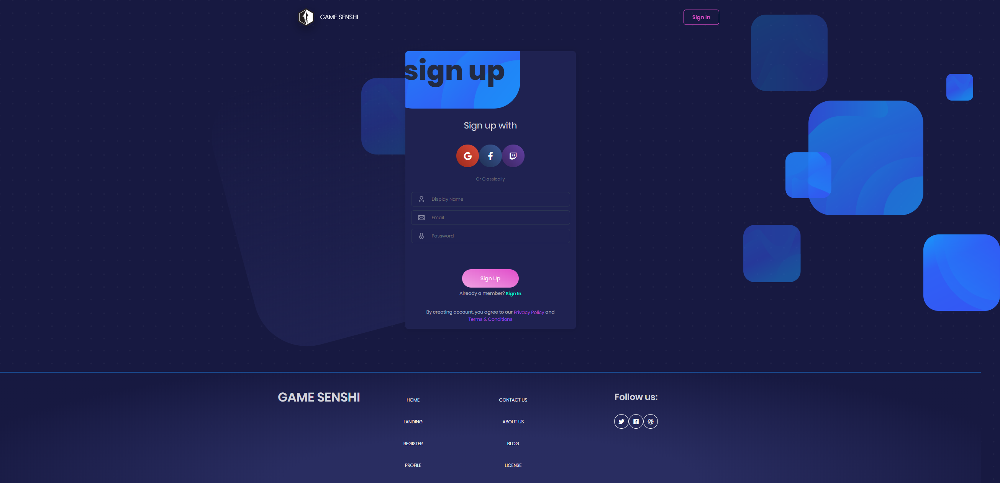
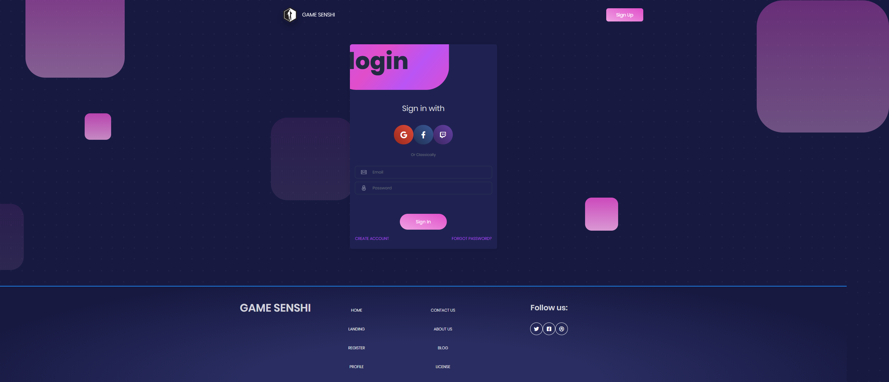
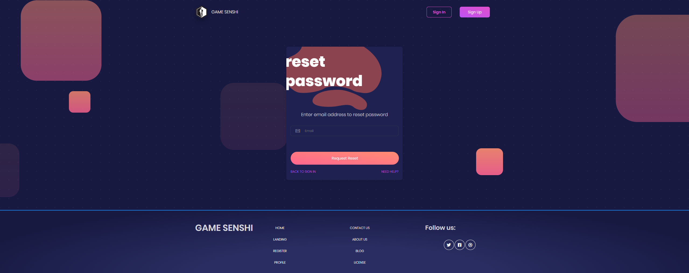
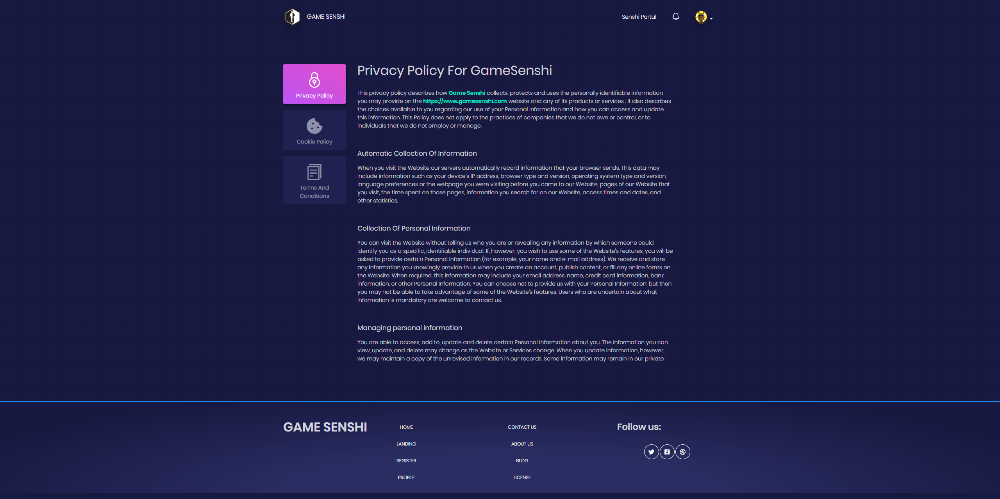
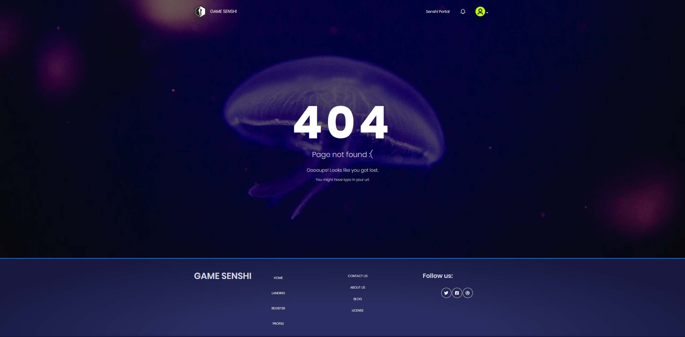

# GAME [SENSHI(戦士)](https://en.wikipedia.org/wiki/Senshi)

<p align="center">
  
</p>

A platform for gamers/streamers to provide their casual service and link up with others in the community.

<<<[**Demo Page**](https://gamessenshi.firebaseapp.com/)>>>

route: index


route: profile/2QvJMnyN73SnBXaLuRR0REQpY8X2


route: signup  
note: each sign up method can be linked to each other, example:

1. sign up with password account then link with Google account
2. sign up with Google account then link with password account.
3. sign up with Twitch account then link with Facebook account.



route: signin


route: reset


route: settings


route: policy


route: `none of above`


## Introduction

This is a project that is designed to allow the user the ability to temporarily hire other gamers to play with them. Similar to hiring someone to work with you, this allows you the opportunity to hire another gamer to game with you. It is all about gaming companionship.

From the consumer perspective:

1. You are a big fan of a professional gamer/famous streamer, and you want to play a game with with your beloved star., either as a sparring partner(opponent), or teammate.
2. You are looking for someone to help you improve as a gamer, and want a gaming "coach" that can help you along in that process.
3. You want to rank up in a specific game, but need help. You need a strong and capable teammate who has lots of experience with that game!
4. You have a nice but less known multiplayer game, hire your fighter here!
5. You're merely looking to hang out and socialize with streamers/gamers in a relaxed environment!

From provider perspective:  

While some gamers/streamers do make a lot of money, the large majority of gamers and/or streamers do not. This platform provides the opportunity for many gamers and streamers to expand their viewer base, reach new potential viewers and people to game with, and make new friends along the way! It also helps to link casual gamers up with more competitive and successful gamers/streamers, and in return helping everyone in the community grow. With this platform, we can create a new work force of gamers who are doing what they love, and making money along the way!

## Application Features

Core Features:

1. Marketplace
2. Payment
3. Chat

Optional Features:

1. Gaming Contents
2. Event Organizer

## Getting Started  

Andrei's [React Course](https://www.udemy.com/complete-react-developer-zero-to-mastery/?couponCode=ZTMREACTLAUNCH) has almost all knowledge you need to get started.  

PS: this is not advertising, this is coincidence, this project already existed for 3 months before the course was released.

## Installation

A step by step series of examples that tell you how to get the development env running.

After git clone

request the `.config` folder(s) from `tylim#9831` in `Discord`

```bash
node install.js
```

## Development (Front End)

```bash
npm run dev
// run with dev env var, this may not work as dev is connect to dev server (experiment server)  

npm run prod
// run with prod env var, recommended since this will work as experted most of the time
```

Now you can start hacking on front end!

## Deployment (Front End)

```bash
npm run d-deploy // deploy to dev server  
npm run p-deploy // deploy to prod server
npm run a-deploy // deploy to both dev and prod server
```

after deployment, you can view it at

1. [prod](https://gamesenshi.com/)
2. [dev](https://game-senshi.firebaseapp.com/)

## Deployment (Back End)

🛑 Ignore this deployment section if you don't want to work with back end (firebase).

Direct message `tylim#9831` in `Discord` your email to become user of this firebase project.

If you skip this step you have to setup your own firebase project.

```bash
npm i && firebase login
```

above command is one time setup, anytime you want to run deploy, simply

```bash
npm run d-deploy // deploy to dev server  
npm run p-deploy // deploy to prod server
npm run a-deploy // deploy to both dev and prod server
```

It will automatically inject production environment variable, build and deploy front end or back end (make sure the command is run in /functions folder).

## Built With

- [Create-React-App](http://www.dropwizard.io/1.0.2/docs/) - React Project Generator
- [Blk• Design System React(Bootstrap)](https://github.com/creativetimofficial/blk-design-system-react/) - CSS
- [Styled Component](https://www.styled-components.com/) - CSS in JS
- [Reactstrap](https://reactstrap.github.io/) - Components
- [Firebase](https://firebase.google.com/) - Authentication, Storage, Database, Chat and Endpoint
- [Stripe](https://stripe.com/) - Payment

Please read [wiki](https://github.com/tylim88/GameSenshi/wiki) for details of our code, techs, guides and resources.

## Contributing

Join our [Trello](https://trello.com/invite/b/tAyH3oig/a5374e9eaa1bbe644f3e7367d1e23300/game-senshi).

Join our Discord Channel


Please read [CONTRIBUTING.md](https://github.com/tylim88/GameSenshi/blob/master/CONTRIBUTING.md) for details on how to contribute.

## Not Sure Know What To Do?

1. **Test** : Start with testing the code for any bugs, if found raise an issue about it. (Always check first if someone has already raised an issue for the same.)

2. **Suggest** features: Look for possible improvements and provide suggestions in the comment section.

3. **Design**: Considering the fact that practice is the main objective, try to make little changes on your forked repository and make a pull-request about it. Commit often and provide appropriate messages to your commits.

4. You can also help in providing proper documentation of the various sections.

Read more [Here](https://github.com/zero-to-mastery/start-here-guidelines/blob/master/Get%20Started.md#how-can-i-contribute-to-projects)
